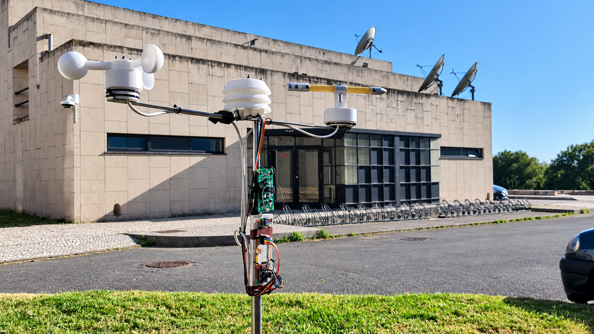
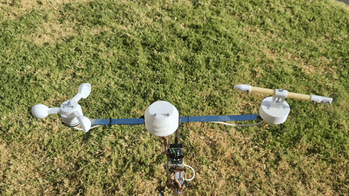
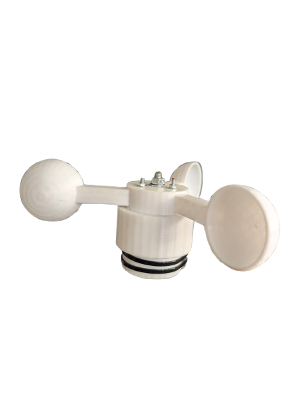
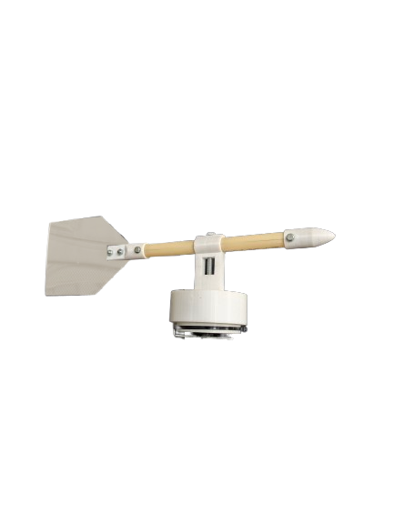
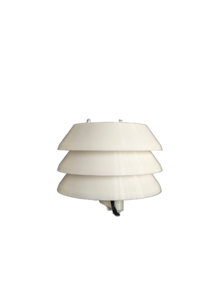
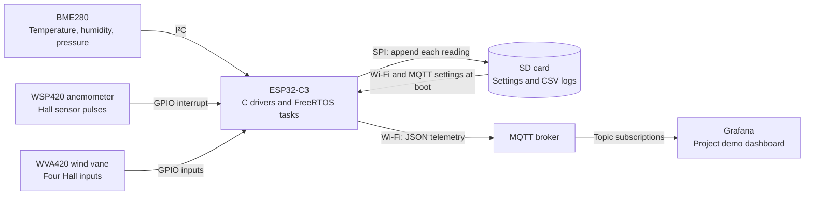
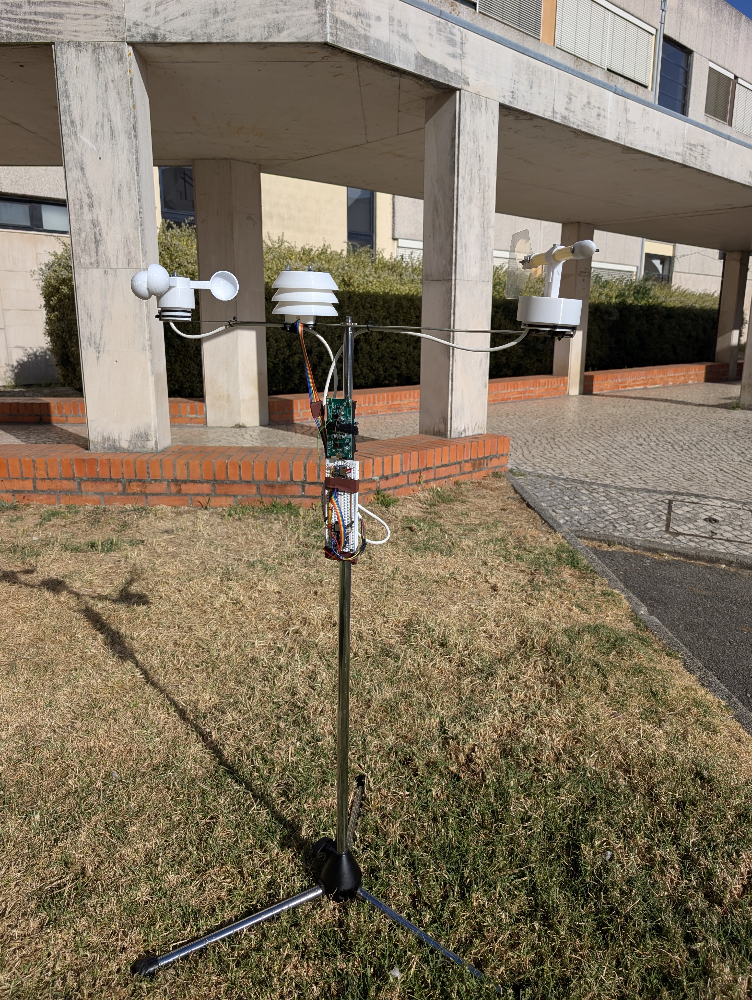
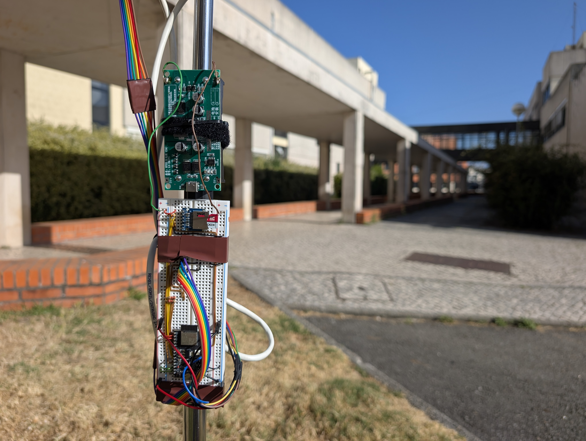

# Smart Weather Station - Building Our Own Wind Sensors

We built a weather station around an ESP32-C3, a BME280, and two wind sensors we designed and assembled ourselves. It measures temperature, humidity, pressure, wind direction, and wind speed, writes readings to an SD card, and publishes them over Wi-Fi and MQTT for a live dashboard.



I worked on this project with Francisco Ribeiro in 2025. Our work covered the physical wind sensors, their C drivers, a register-level BME280 driver, and the firmware connecting those measurements to storage and the network.



*The station in operation: anemometer on the left, BME280 housing in the middle, and wind vane on the right.*

[Setup and technical reference](DOCUMENTATION.md) · [Original project presentation](presentation.pdf)

## Why We Built It

The starting point was affordable, local weather monitoring. A small agricultural plot, a research experiment, or a weather enthusiast's garden needs measurements from that location. We wanted to build a station whose hardware and firmware we could understand, change, and extend.

Wind measurement gave us a reason to work on the mechanics as well as the electronics. We built a cup anemometer and a wind vane using 3D-printed parts, magnets, and Hall-effect sensors. That meant working through the whole measurement: how the wind moves a part, how that movement becomes an electrical signal, and how the firmware turns the signal into a useful reading.

The other practical concern was where the data would go. The station keeps a local CSV record and publishes the same readings through MQTT. Network access makes the measurements convenient to watch; the SD card gives us a copy at the station.

## What It Does

- Reads temperature, relative humidity, and pressure from a BME280 through our own driver.
- Estimates wind speed from the rotation of a custom cup anemometer, the **WSP420**.
- Resolves eight compass directions using a custom wind vane, the **WVA420**.
- Runs sensor acquisition in three FreeRTOS tasks, with GPIO interrupts counting anemometer pulses.
- Timestamps readings using an SNTP-synchronized clock, then writes CSV files and publishes JSON over MQTT.
- Loads Wi-Fi and broker settings from the SD card, so changing networks does not require rebuilding the firmware.
- Supplies the live measurements shown in the project's Grafana dashboard.

## Building the Wind Sensors

The WSP420 and WVA420 names refer to the two sensors we made for this project. Both use magnets and Hall-effect sensing, but they answer different questions: how fast something is rotating, and which way something is pointing.

<table>
  <tr>
    <td align="center"><br><b>WSP420 anemometer</b></td>
    <td align="center"><br><b>WVA420 wind vane</b></td>
  </tr>
</table>

### Wind Speed: From Rotation to Pulses

The anemometer has three cups attached to a rotating hub. Magnets move past a Hall sensor in the base as the cups turn, producing transitions the ESP32 can count. We used A3144 Hall-effect sensors in the wind sensor assemblies.

Our [wind-speed driver](main/wind_speed/wind_speed_sensor.c) configures a GPIO interrupt on each rising edge. During a seven-second measurement window, the interrupt handler increments a counter. The task then converts the pulse rate into a speed estimate using the configured rotor radius and a calibration factor:

```text
speed estimate = (pulses / 7 seconds) × radius in metres × calibration factor
```

The current configuration uses a 4 cm radius and a factor of 24.0. That factor is marked as an example in the source; the repository does not include a calibration dataset. The dashboard displays the result as wind speed, but establishing its accuracy would require comparison with a reference instrument.

The seven-second wait yields to FreeRTOS, so the other sensor tasks keep running while pulses are counted. After recording and publishing the result, the wind-speed task waits another three seconds. This gives roughly one reading every ten seconds, with a gap between counting windows.

### Wind Direction: Four Inputs, Eight Bearings

The vane turns a magnet relative to four Hall sensors arranged around the north, east, south, and west positions. Our [wind-direction driver](main/wind_direction/wind_direction_sensor.c) reads their active-low outputs through GPIO inputs with pull-ups.

One active input identifies a cardinal direction. Two adjacent active inputs identify the direction between them: north and east together become north-east, for example. If none is active, the driver returns `Unknown`.

This gives eight compass directions from four digital inputs. The firmware polls the vane about every two seconds and publishes a readable label such as `North-East`. The physical assembly still needs to be aligned with north; automatic alignment and self-calibration were left as future work.

## Writing the BME280 Driver

Temperature, humidity, and pressure come from a BME280 mounted under the station's layered shield. The sensor is a standard component; the [C driver](main/bme280/bme280.c) is part of this project.

<p align="center">
  
</p>

The driver handles the work between a bus transaction and a measurement. It checks the chip ID, resets the device, reads its factory calibration coefficients, and configures measurement modes, oversampling, filtering, and standby time. A reading fetches eight measurement bytes, unpacks the raw temperature, pressure, and humidity values, and applies the compensation equations from the BME280 datasheet.

We implemented both I²C and SPI access. The assembled station uses I²C at 100 kHz, with the sensor in normal mode and 1× oversampling on all three channels. The driver also exposes forced measurements and sleep mode, although the main application uses periodic reads from normal mode.

One detail to correct before reusing the measurements is the pressure scale: the current conversion and the `hPa` label disagree. The original dashboard screenshot retains that label. The [measurement notes](DOCUMENTATION.md#measurement-notes) explain the mismatch and the wind calibration assumptions.

## From a Sensor Reading to the Dashboard

The firmware is written in C using ESP-IDF and FreeRTOS. Three tasks acquire the measurements, and a shared data-handling module formats each result for local storage and MQTT.



| Acquisition task | What it reads | Approximate reporting interval |
| --- | --- | --- |
| BME280 | Temperature, pressure, humidity | 2 seconds |
| WVA420 | One of eight compass directions, or unknown | 2 seconds |
| WSP420 | Pulse count converted to a speed estimate | 10 seconds: 7 seconds counting, then 3 seconds waiting |

At startup, the ESP32 mounts the SD card, loads the connection settings, joins Wi-Fi, and attempts to synchronize its clock through SNTP. It then connects to the broker and starts the sensor tasks. Each successful reading gets a Unix timestamp, a CSV append attempt, and an MQTT publish attempt, in that order.

The topics separate the three sensor streams: `ase-proj/bme280`, `ase-proj/wva420`, and `ase-proj/wsp420`. That lets a subscriber consume just the measurements it needs. The [payload reference](DOCUMENTATION.md#mqtt-topics-and-payloads) includes the exact fields and types.


*The dashboard used for the project demonstration. Broker and Grafana configuration are separate from the firmware and are not included in this repository.*

## Keeping a Copy at the Station

The SD card has two jobs. At boot, it provides `wifi_settings.txt` and `mqtt_settings.txt`. During operation, it holds a separate CSV file for each sensor stream.

Every successful sensor reading goes through the local logging path, including while MQTT is disconnected. This makes it possible to recover locally recorded measurements that never reached the dashboard. The firmware does not upload old CSV rows when the connection returns; the files are a local record, and MQTT is a live feed using QoS 0.

The prototype also includes an 18650 battery UPS module, shown above the controller in the photo below. Battery-level reporting and energy-management logic were future work; the firmware does not yet use deep sleep or adapt its sampling to the available power.

<table>
  <tr>
    <td align="center"><br><b>The assembled station</b></td>
    <td align="center"><br><b>Controller, storage, and power</b></td>
  </tr>
</table>

## Inside the Firmware

The code is split by hardware and service, with `main.c` responsible for configuration and startup. The wind drivers expose initialization and reading functions, the BME280 driver handles bus access and compensation, and the data handler connects their outputs to the two destinations.

| Source | Responsibility |
| --- | --- |
| [main/main.c](main/main.c) | Pin assignments, sensor configuration, startup, clock synchronization, and acquisition tasks |
| [main/wind_speed/](main/wind_speed/) | Anemometer GPIO interrupt, measurement window, and speed calculation |
| [main/wind_direction/](main/wind_direction/) | Four-input Hall sensor decoding into compass directions |
| [main/bme280/](main/bme280/) | Register access over I²C/SPI, device configuration, and measurement compensation |
| [main/data_handler/](main/data_handler/) | Timestamps, CSV records, JSON payloads, and topic selection |
| [main/sd_utils/](main/sd_utils/) | SPI/FAT mounting, file access, and connection-settings parsing |
| [main/wifi_utils/](main/wifi_utils/) | Wi-Fi station setup, connection events, and reconnect attempts |
| [main/mqtt_utils/](main/mqtt_utils/) | ESP-MQTT client lifecycle and publishing |

The build uses CMake and an ESP-IDF 5.4.1 configuration targeting the ESP32-C3. The hardware interfaces are I²C, SPI, and GPIO; the network path uses Wi-Fi, SNTP, and MQTT, with Grafana used for the demonstration.

## What I Would Work on Next

Building the wind sensors made the relationship between mechanics and firmware very concrete. A pulse counter can report rotation, but turning that into a trustworthy wind measurement also depends on friction, cup geometry, magnet placement, and calibration. I would start a second version by reducing the moving parts' weight and friction, then recording measurements against a reference anemometer.

For longer outdoor use, I would improve the enclosure and wiring, add battery monitoring, and revisit sampling and power consumption. The firmware also needs attention to memory use and connection recovery, particularly when the MQTT broker is unavailable at startup. Replaying stored readings would need an explicit delivery queue as well.

The repository preserves the working prototype and its original demonstration material. The [implementation notes](DOCUMENTATION.md#implementation-notes) describe the remaining limitations.

## Running the Project

Start with [DOCUMENTATION.md](DOCUMENTATION.md) for the hardware pinout, SD card preparation, ESP-IDF configuration, build and flash commands, and MQTT/CSV formats. The original [presentation PDF](presentation.pdf) and [editable slides](presentation.pptx) include the hardware diagrams and development plans. Photos and the demo GIF are in [images/](images/).

Built by [Miguel Vila](https://github.com/miguelovila) and [Francisco Ribeiro](https://github.com/FranciscoRibeiro03) for Embedded Systems Architectures at the University of Aveiro, in 2025.
